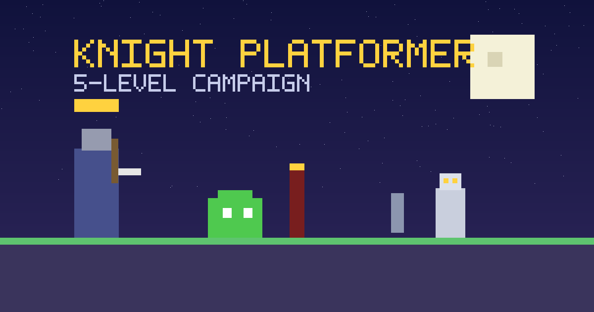

# Knight Platformer — 5-Level Campaign (v1.0.0)



Game platformer 2D side-view: ksatria pixel-art 32x32. Dari menu utama,
mainkan **5 level campaign**:
**Level 1 — Slime Grounds** (coin, checkpoint, FINISH),
**Level 2 — Slime Dominion** (celah, coin, checkpoint, **RAJA SLIME**),
**Level 3 — Skeleton Fortress** (coin, checkpoint, FINISH),
**Level 4 — Lich Domain** (coin, checkpoint, miniboss **PANGLIMA TULANG**,
**RAJA LICH**),
**Level 5 — Final Convergence** (coin, **RAJA SLIME lalu RAJA LICH**
berurutan, GAME COMPLETE).

Combat di level FINISH (L1/L3) bersifat opsional — traversal yang jujur:
cukup capai FINISH. Boss wajib dikalahkan di L2/L4/L5.

**Status: Final Release v1.0** — playable: https://adjietegaralamsyah312.github.io/Game/

## Fitur v1.0

- Menu utama (PLAY / CAMPAIGN / CONTROLS / SETTINGS / ABOUT, keyboard + sentuh)
- Campaign Select: replay 5 level terbuka (🔒 locked, ✓ CLEAR + best time), tanpa bypass progression
- 5 level + transisi fade, reset level tanpa reload browser
- Level 1 — Slime Grounds: onboarding cerah + 6 Coin (risk/reward di atas celah)
- Level 2 — Slime Dominion: blood moon, 3 celah, Fast solo / Heavy solo / kombo, arena boss
- Level 3 — Skeleton Fortress: Skeleton Sword (pressure), Skeleton Defender
  (tank perisai, guard frontal), Skeleton Archer (ranged), 2 checkpoint, 6 coin
- Level 4 — Lich Domain: skeleton elite + miniboss **PANGLIMA TULANG**
  (2 pola + enrage + HP bar) + **RAJA LICH** (3 phase + summon, HP bar), 2 checkpoint, 8 coin
- Level 5 — Final Convergence: slime + skeleton, gauntlet
  **RAJA SLIME → interlude → RAJA LICH**; mati di gauntlet mengulang dari awal
  (by design, reset hanya untuk run berjalan)
- Skeleton Knight miniboss (sprite full-armor + pedang besar + cape)
- Raja Lich final boss (sprite crown + robe + staff + orb, aura phase)
- Treasure Chest (L1/L2/L3/L4/L5): serang dengan pedang untuk membuka
  (closed→opening→opened, sekali saja, aman dari duplikat & persist respawn); reward random
  Gold Shard (+1, HUD & total persist) / Health (+30, clamp max) / Poison (−HP, min 1)
- 6 enemy archetype: Slime, Fast Slime, Heavy Slime,
  Skeleton Swordsman, Skeleton Defender, Skeleton Archer
  (sprite PNG dark-fantasy di `assets/sprites/`; walk + windup/strike,
  guard, aim/release; miniboss slash/dash; lich cast/strike)
- Boss RAJA SLIME: intro sekali, HP bar, strike/charge/shockwave, telegraph, enrage
- Collectible Coin (`got/total` di HUD, sprite `coin.png`) + suara coin
- Stats per-level & total (musuh, coin, gold shard, waktu, mati) + best lokal
- Level Complete (NEXT/REPLAY/MENU) & Game Complete (PLAY AGAIN/MENU)
- Explicit pause: tombol ⏸, `P` / `Esc` (freeze gameplay + timer + BGM suspend, tanpa input bocor)
- Kamera smooth, parallax, partikel pool, screen shake (nonaktif saat reduced-motion),
  debug overlay (`DEBUG=true`: FPS, avg/peak/p95 frame time, enemy/projectile/particle)
- Touch via Pointer Events (multi-touch, anti double by-design, pointercancel aman)
- Checkpoints + coin/statistics + persistence unlock L1→L5

## Settings

Dari Main Menu → **SETTINGS** (`↑`/`↓` + `Enter`, `Esc` kembali):

- **SFX ON/OFF** + volume 0–100% (langsung, tanpa reload)
- **Music ON/OFF** + volume 0–100% (BGM prosedural Web Audio, langsung)
- **Input favorit**: AUTO / KEYBOARD / TOUCH (keyboard + touch selalu aktif)
- **RESET**: hapus progres + settings via dialog konfirmasi (CANCEL/RESET)

## Persistence

Satu key terversi **`knightSaveV1`** (schema v3, migrasi aman dari v1/v2:
field audio hilang berarti ON): best total/L1–L5, best coin, total coin/gold shard/mati,
completion L1–L5/game, unlock L2–L5, settings. Migrasi v1/v2→v3: totalCoins lama
tetap coin (tidak dianggap gold shard), totalShards lama digabung ke totalCoins
(keduanya kini currency coin), bestShards lama → bestCoins, totalGoldShards mulai 0.
Guarded: JSON rusak → default;
localStorage hilang → fallback memori. Tulis event-driven (bukan per-frame).

- L1 selalu terbuka; L2 setelah L1, L3 setelah L2, L4 setelah L3, L5 setelah L4
- Best time hanya membaik; reload tak menghapus progres
- PLAY baru tak menghapus save; hanya RESET yang menghapus

## Kontrol desktop

| Tombol | Aksi |
|---|---|
| `A` / `D` atau `←` / `→` | Bergerak kiri / kanan |
| `Space` / `W` / `↑` | Lompat (tahan = lebih tinggi) |
| `J` / `X` | Serang pedang |
| `R` | Respawn checkpoint (saat playing maupun Game Over) |
| `Enter` | Next / main lagi (kontekstual) |
| `P` / `Esc` | Pause / resume (saat playing) |
| `↑` / `↓` + `Enter`, `Esc` | Navigasi menu/settings/campaign |

## Kontrol mobile (Android)

Tombol sentuh: **◀ ▶** gerak, **⤒** lompat, **❖** serang, **⏸** pause.
Multi-touch (gerak + lompat/serang bersamaan). Semua dialog touch-friendly.
Layout portrait + landscape pendek (dialog fullscreen, canvas 16:9).

## Accessibility

- Semua dialog: `role="dialog"` + `aria-modal` + label; fokus ke kontrol pertama
  saat dibuka dan kembali ke pemicu saat ditutup; `Esc` valid per state
- Fokus keyboard terlihat (`:focus-visible`); tombol berlabel (`aria-label`)
- Pinch zoom browser tetap diizinkan (tanpa `user-scalable=no`)
- `prefers-reduced-motion`: screen shake nonaktif, gameplay tetap sama

## Tech stack

HTML5 Canvas + JavaScript vanilla + CSS — tanpa framework, tanpa dependency,
tanpa CDN. Satu file `game.js` (`file://`-ready, GitHub Pages subpath `/Game/`,
semua path relatif). Musuh & boss prosedural (Canvas pixel-style).
Satu `requestAnimationFrame`; pool partikel/proyektil bounded; tanpa `setInterval` game.

## Audio

- **BGM prosedural Web Audio**: loop dark-fantasy ~100 BPM (bass, pad,
  arpeggio, motif + variasi), Web Audio clock (tanpa `setInterval`),
  satu AudioContext, tanpa node bocor/duplikat; mood per level
  (slime / dungeon / final) tanpa restart scheduler
- **SFX prosedural**: lompat, serang, hit, checkpoint, menang, boss, coin,
  gold shard, skeleton hit, sword swing, shield block, arrow shot/impact,
  miniboss cue, lich magic/summon, phase shift, chest open/heal/poison
- **Volume independen** SFX/Music 0–100%; OFF/0 = diam; live tanpa reload
- **Autoplay/unlock**: audio mulai setelah gesture pertama; pause suspend aman;
  BGM ikut state (menu/main, berhenti saat Game Over/Complete)

```
knight_game/
├── index.html          # kanvas + overlay + metadata/OG
├── game.js             # seluruh game (5 level, boss, treasure, save, BGM)
├── style.css           # tema + responsif + safe-area + reduced-motion
├── test.js             # 234 automated test headless (node test.js)
├── README.md           # file ini
├── CHANGELOG.md        # riwayat rilis
├── VERSION             # 1.0.0
└── assets/
    ├── knight/         # 18 sprite PNG ksatria
    ├── sprites/        # 14 sprite undead + chest + coin + reward (lokal, termasuk gold-shard.png)
    └── og/             # social preview 1200x630 (lokal, tanpa CDN)
```

## Arsitektur asset

Sprite PNG lokal (`assets/sprites/`) dimuat via loader yang sama dengan
sprite ksatria (`Promise.all`, fallback magenta bila gagal, `assetsReady`
gate). Render memakai `drawImage` bottom-anchored + flip arah hadap
(`imageSmoothingEnabled=false` tetap); bila sprite belum siap dipakai
fallback prosedural sehingga game tak pernah crash. Hitbox/AI/HP/damage/
timing tidak berubah oleh pergantian visual.

## Visual Polish (Stage 11)

- **Knight player art**: set heroik lokal `assets/sprites/knight-*.png`
  (idle, walk 2-frame, attack, attack-2 kombo, jump, fall, hurt, death,
  victory) — helm/visor, armor + trim emas, cape/tabard merah, pedang
  silhouette jelas; dipakai bila siap dengan fallback ke `assets/knight/`
  tanpa ubah hitbox, physics, timing, atau damage.
- **Environment identities**: dekorasi data-driven `LEVEL_DECOR`
  (torch api 2-frame, banner, ruin, bones, rune, soul, slime, pillar)
  per level — Slime Grounds, Slime Dominion, Skeleton Fortress,
  Lich Domain, Final Convergence. Parallax 3 layer dipertahankan.
- **Combat effects**: busur slash memudar, semburan lepas panah,
  hit-stop micro-freeze 30–80ms (cap, nonaktif saat reduced-motion),
  shake cap 8, shield spark & telegraph existing dipertahankan.
- **Treasure polish**: highlight emas saat player dekat, reward icon
  bounce, hasil tetap Gold Shard/Health/Poison (tanpa Coin).
- **Boss presentation**: aura intro (RAJA SLIME, PANGLIMA TULANG,
  RAJA LICH), pulse transisi phase Lich — visual saja, balance utuh,
  death-first & victoryArmed safety utuh.
- **Victory**: judul `CAMPAIGN COMPLETE!`, stats Coin • Gold Shard •
  Musuh • Mati • Waktu • Terbaik, tombol REPLAY/CAMPAIGN/MENU.
- **HUD**: label `COIN n/m LVn` + `GOLD xN`, layout & safe-area sama.

## Cara menjalankan lokal

```bash
cd /root/project/knight_game
python3 -m http.server 8000
# buka http://localhost:8000
```

Atau buka `index.html` langsung. Audio aktif setelah interaksi pertama.

## Cara menjalankan test

```bash
node --check game.js
node --check test.js
node test.js
git diff --check
```

234 automated test (164 campaign/hardening + 13 final release + 15 treasure/asset + 1 attack-direction + 4 attack-frame + 12 coin/gold-shard swap + 14 stage 11 polish + 4 skeleton crumble/pit + 3 skeleton walk + 3 bone pile + 1 pit persisten) —
target semua PASS, 0 FAIL.
target semua PASS, 0 FAIL.

## Spesifikasi minimum yang disarankan

- Android kelas menengah (Chrome modern), RAM 3 GB+, layar 360px ke atas
- Backing store kanvas maks 2x DPR; pool partikel 120, proyektil 10

## Catatan pengujian (jujur)

- Headless: 177/177 PASS + QA campaign penuh (MENU→L1→…→L5→COMPLETE→replay→reload),
  HTTP 200 semua aset, `console.error` 0.
- **Physical QA Android belum dilakukan di perangkat nyata** (tidak ada klaim FPS
  HP, rasa multi-touch, rotasi fisik, audio unlock Chrome Android, lifecycle
  telepon/notifikasi). Perlu uji fisik sebelum klaim performa perangkat.

## Project status & Development History

- Status: **v1.0.0 Final Release**, live di GitHub Pages.
- Repository: https://github.com/Adjietegaralamsyah312/Game
- History singkat: Tahap 4 Release Candidate → Content Expansion (Stage 5:
  2 level + RAJA SLIME) → Settings & Persistence (Stage 6) → BGM prosedural
  (Stage 7) → Skeleton Campaign L3–L5 + miniboss + RAJA LICH (Stage 9) →
  combat hardening C1/C2/M1–M9 → v1.0 Final Release (campaign select, pause,
  Pointer Events, a11y, OG image).
