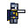

# Knight Platformer — Skeleton Campaign



Game platformer 2D side-view: ksatria pixel-art 32x32. Dari menu utama,
mainkan **5 level**:
**Level 1 — Slime Grounds** (shard, slime, checkpoint, FINISH),
**Level 2 — Slime Dominion** (celah, shard, checkpoint, **RAJA SLIME**),
**Level 3 — Skeleton Fortress** (skeleton, shard, checkpoint, FINISH),
**Level 4 — Lich Domain** (miniboss **PANGLIMA TULANG**, shard, checkpoint,
**RAJA LICH**),
**Level 5 — Final Convergence** (slime + skeleton, shard, **RAJA SLIME +
RAJA LICH** berurutan).

**Status: Skeleton Campaign** — playable: https://adjietegaralamsyah312.github.io/Game/

## Fitur utama (Stage 9)

- Menu utama (PLAY / CONTROLS / SETTINGS / ABOUT, navigasi keyboard + sentuh)
- 5 level + transisi fade, reset level tanpa reload browser
- Level 1 — Slime Grounds: layout original cerah (onboarding) + 6 Gold Shard tier
  mudah/menengah/sulit (satu di atas celah = risk/reward)
- Level 2 — Slime Dominion: tema gelap + blood moon, traversal baru, 3 celah, checkpoint,
  encounter Fast solo / Heavy solo / kombo Fast+Heavy, arena boss berobor
- Level 3 — Skeleton Fortress: fortress dingin, Skeleton Swordsman (pressure),
  Skeleton Defender (tank perisai, guard frontal), Skeleton Archer (ranged),
  encounter tutorial + mixed, 2 checkpoint, 6 shard
- Level 4 — Lich Domain: crypt ungu, skeleton elite + miniboss **PANGLIMA TULANG**
  (2 pola + enrage + HP bar), final boss **RAJA LICH** (3 phase + summon + HP bar),
  2 checkpoint, 8 shard
- Level 5 — Final Convergence: gabungan slime + skeleton, gauntlet
  **RAJA SLIME lalu RAJA LICH**, 2 checkpoint, 8 shard
- 6+ enemy archetype reusable: Slime, Fast Slime, Heavy Slime,
  Skeleton Swordsman, Skeleton Defender, Skeleton Archer; slime klasik tak berubah
- Boss RAJA SLIME: intro arena, HP bar, 3 pola (strike, charge, shockwave),
  telegraph, enrage (visual + debu charge), death FX + kemenangan
- Miniboss Panglima Tulang + Raja Lich: intro sekali, telegraph visual + audio,
  HP bar, phase/enrage, death flow deterministik
- Collectible Gold Shard (counter `got/total` di HUD) + suara pickup
- Stats per-level & total (musuh, shard, waktu, mati) + best lokal
- Layar Level Complete (NEXT/REPLAY/MENU) & Game Complete (PLAY AGAIN/MENU)
- Kamera smooth, parallax, partikel pool, screen shake, pause aman,
  debug overlay (`DEBUG=true`)
- Touch controls + responsive design (portrait + landscape pendek,
  dialog fullscreen, canvas 16:9)
- Checkpoints + shard/statistics + persistence unlock L1→L5

## Settings (Stage 6)

Dari Main Menu → **SETTINGS** (atau `↑`/`↓` + `Enter`, `Esc` kembali):

- **SFX ON/OFF** + volume 0–100% (berlaku langsung, tanpa reload)
- **Music ON/OFF** + volume 0–100% (BGM prosedural Web Audio,
  berlaku langsung)
- **Input favorit**: AUTO / KEYBOARD / TOUCH (preferensi tampilan;
  keyboard + touch selalu aktif)
- **RESET**: hapus progres + settings via dialog konfirmasi (CANCEL/RESET)

## Persistence (Stage 6 + 9)

Satu key terversi **`knightSaveV1`** di localStorage (schema v2, migrasi aman
dari v1): best total/L1/L2/L3/L4/L5,
best shard, total shard/mati, completion L1–L5/game, unlock L2–L5, dan
semua settings. Guarded: JSON rusak → default; localStorage hilang →
fallback memori; game tetap jalan. Irit: tulis hanya saat settings
berubah, checkpoint/progress, complete, mati, dan reset — bukan per-frame.

- Level 1 selalu terbuka; L2 setelah L1, L3 setelah L2, L4 setelah L3,
  L5 setelah L4; Game Complete setelah L5
- Best time hanya membaik; reload tak menghapus progres
- PLAY baru tak menghapus save; hanya RESET yang menghapus
- Save lama (v1) tetap valid: field baru diberi default

## Kontrol desktop

| Tombol | Aksi |
|---|---|
| `A` / `D` atau `←` / `→` | Bergerak kiri / kanan |
| `Space` / `W` / `↑` | Lompat (tahan = lebih tinggi) |
| `J` / `X` | Serang pedang |
| `R` / `Enter` | Respawn / next / main lagi (kontekstual) |
| `↑` / `↓` + `Enter`, `Esc` | Navigasi menu/settings / kembali |

## Kontrol mobile (Android)

Tombol sentuh di bawah kanvas: **◀ ▶** gerak, **⤒** lompat, **❖** serang.
Multi-touch didukung. Semua tombol menu/settings/clear touch-friendly.
Guard 500 ms mencegah double-trigger touch + mouse emulasi. Layout
portrait + landscape pendek (dialog fullscreen, canvas tetap 16:9).

## Tech stack

HTML5 Canvas + JavaScript vanilla + CSS — tanpa framework, tanpa dependency,
tanpa CDN. Satu file `game.js` agar tetap jalan via `file://` dan kompatibel
dengan GitHub Pages subpath `/Game/` (semua path relatif). Grafis musuh
baru & boss prosedural (Canvas pixel-style).

## Struktur project

## Audio

- **BGM prosedural Web Audio**: loop dark-fantasy ~100 BPM (bass, pad,
  arpeggio, motif + variasi), dijadwalkan dari Web Audio clock
  (tanpa `setInterval`), satu AudioContext, tanpa node bocor/duplikat;
  mood per level (slime / dungeon / final) tanpa restart scheduler
- **SFX prosedural**: lompat, serang, hit, checkpoint, menang, boss, pickup,
  skeleton hit, sword swing, shield block, arrow shot/impact,
  miniboss cue, lich magic/summon, phase shift
- **Volume independen**: SFX 0–100% dan Music 0–100% via jalur gain
  terpisah; OFF/volume-0 = diam total; perubahan live tanpa reload
- **Autoplay/unlock**: audio (termasuk BGM) mulai setelah tap/klik/keydown
  pertama; pause men-suspend aman; BGM mengikuti state (menu/main,
  berhenti saat Game Over/Complete, resume tanpa overlap)

```
knight_game/
├── index.html          # kanvas + overlay (menu/settings/clear) + metadata
├── game.js             # seluruh game (menu, 5 level, skeleton, miniboss, lich, save, BGM)
├── style.css           # tema + responsif + safe-area Android
├── test.js             # 154 automated test headless (node test.js)
├── README.md           # file ini
└── assets/knight/      # 18 sprite PNG (idle/run/jump/fall/attack/hurt/death)
```

## Cara menjalankan lokal

```bash
cd /root/project/knight_game
python3 -m http.server 8000
# buka http://localhost:8000
```

Atau buka `index.html` langsung. Audio aktif setelah interaksi pertama
(aturan autoplay browser).

## Cara menjalankan test

```bash
node --check game.js
node --check test.js
node test.js
git diff --check
```

154 automated test (133 dasar/responsif/settings/BGM/menu/audit/grounding + 21 skeleton/lich/final) —
target semua PASS, 0 FAIL.

## Spesifikasi minimum yang disarankan

- Android kelas menengah (Chrome modern), RAM 3 GB+, layar 360px ke atas
- Backing store kanvas dibatasi maks 2x DPR; pool partikel 120

## Catatan pengujian

- **FPS nyata di Android perlu physical testing** (aktifkan `DEBUG=true` dan
  baca overlay FPS/frame-time di perangkat). Dokumen ini tidak mengklaim
  angka performa, dukungan perangkat, atau benchmark apa pun.
- Yang masih butuh uji fisik: FPS di HP lemah, rasa tombol multi-touch +
  menu/settings di layar kecil, pause saat telepon/notifikasi, rotasi
  portrait/landscape, audio unlock di Chrome Android.

## Project status & future improvements

- Status: Skeleton Campaign (5 level + miniboss + Raja Lich + final convergence), live di GitHub Pages.
- Repository: https://github.com/Adjietegaralamsyah312/Game
- Ide lanjutan (belum dikerjakan): pola boss baru,
  variasi trek BGM, pengujian FPS terdokumentasi di perangkat fisik.
